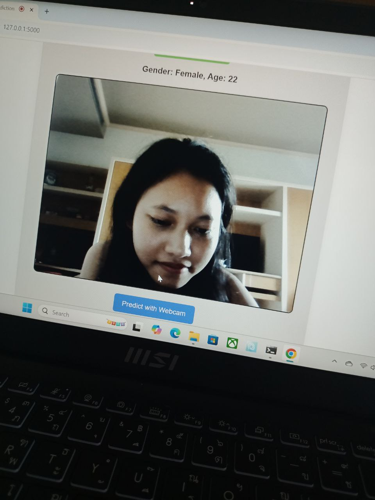

# Age and Gender Detection Using Deep Learning

This project is a **web-based age and gender detection system** that uses deep learning to predict a person's age and gender from images or real-time webcam input. The system is built with a Convolutional Neural Network (CNN) and deployed as an interactive web application.

---

## Project Motivation

Age and gender detection has practical applications in areas such as:

* Security and surveillance
* Retail and customer analytics
* Advertising and audience analysis
* Human–computer interaction

This project demonstrates how deep learning can be applied to real-world computer vision problems.

---

## Model Overview

* **Dataset:** UTKFace Dataset
* **Model Type:** Convolutional Neural Network (CNN)
* **Framework:** TensorFlow / Keras
* **Architecture:** Multi-output model

  * Gender prediction (classification)
  * Age prediction (regression)

### Outputs

* **Gender:** Sigmoid activation (Male / Female)
* **Age:** ReLU activation (predicted age value)

---

## Model Performance

* **Gender Accuracy:** 83.54%
* **Age Prediction Error (MAE):** 6.7 years

---

## Image Preprocessing & Prediction Workflow

1. Convert input images to grayscale
2. Detect and crop faces using OpenCV
3. Resize and normalize images
4. Feed preprocessed faces into the CNN model
5. Predict age and gender for each detected face

The system supports **multiple face detection** within a single image.

---

## Web Application Features

* Upload images for age and gender prediction
* Real-time webcam integration
* Display predicted age and gender results
* Handle multiple faces in one image

---

## Tech Stack

**Machine Learning**

* TensorFlow
* Keras
* OpenCV

**Backend**

* Flask

**Frontend**

* HTML
* CSS
* JavaScript

---

## Challenges & Solutions

**Challenge:** Handling multiple faces in a single image
**Solution:** Implemented OpenCV-based face detection to detect and predict each face individually

**Challenge:** Improving prediction accuracy
**Solution:** Applied image preprocessing techniques such as grayscale conversion and face cropping

---

## How It Works (Webcam Mode)

1. Capture image from webcam
2. Detect faces in real time
3. Run predictions on detected faces
4. Display results instantly

---

##  Screenshots

| Demo |
|-------------|
|  |

## Dataset

* UTKFace Dataset
* Contains labeled images with age and gender information

---

## Source Code

GitHub Repository:
[https://github.com/LwinTharaphi/age_gender_detection](https://github.com/LwinTharaphi/age_gender_detection)

---

## 👤 Author

**Tharaphi Lwin**
Deep Learning / Computer Science Student
Assumption University of Thailand

---

## References

* Analytics Vidhya – Age and Gender Detection Using Deep Learning
* Kaggle – Age and Gender Prediction CNN

---

Thank you for checking out this project!
